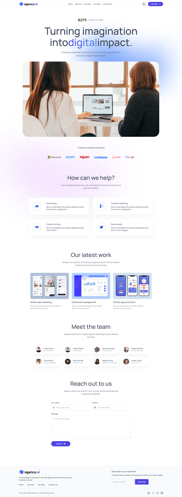

<div align="center">

# 🚀 Agency.AI

A modern, fully responsive **digital marketing agency** landing page built with **React 19** and **Tailwind CSS v4**. Featuring smooth scroll-triggered animations, a persistent dark/light theme toggle, and a clean single-page layout that showcases services, portfolio work, and team members.

[](https://react.dev/)
[](https://tailwindcss.com/)
[](https://motion.dev/)
[](https://vitejs.dev/)
[](LICENSE)

</div>

---

## 🌍 Live Demo

> 🔗 **Live URL:** *(Deploy to Vercel / Netlify and add your link here)*

---

## 📸 Screenshots



---

## ✨ Features

- 🌗 **Dark / Light Mode** — Persistent theme toggle powered by `localStorage` and system preference detection
- 🎞️ **Scroll-Triggered Animations** — Every section animates in using `motion/react` (fade, slide, stagger)
- 📱 **Fully Responsive** — Mobile-first layout with a collapsible sidebar navigation on small screens
- 🖱️ **Mouse-Tracking Glow Effect** — Interactive gradient spotlight that follows the cursor on service cards
- 🏢 **Trusted Companies Marquee** — Logos of Microsoft, Google, Airbnb, Zoom, Rakuten, and Coinbase
- 🛠️ **Services Section** — Four service cards (Advertising, Content Marketing, Content Writing, Social Media)
- 🗂️ **Portfolio / Our Work** — Three project showcase cards with hover scale animation
- 👥 **Team Section** — Eight team member cards with staggered reveal animations
- 📬 **Contact Form** — Name, email, and message fields with animated entrance
- 📧 **Newsletter Subscription** — Email subscription input in the footer
- 🔗 **Smooth Scroll Navigation** — Anchor-based navigation with `scroll-smooth` on the HTML root
- 🎨 **Custom Brand Color** — Primary indigo (`#5044e5`) defined as a Tailwind CSS v4 theme token
- 🔤 **Custom Typography** — Google Fonts **Manrope** applied globally

---

## 🛠 Tech Stack

| Category | Technology |
|---|---|
| **UI Library** | React 19 |
| **Styling** | Tailwind CSS v4 (`@tailwindcss/vite`) |
| **Animation** | Motion (`motion/react`) v12 |
| **Build Tool** | Vite 7 |
| **Font** | Google Fonts — Manrope |
| **Linting** | ESLint 9 + `eslint-plugin-react`, `eslint-plugin-react-hooks` |
| **Formatting** | Prettier 3 |

---

## 📂 Project Structure

```
agency-ai/
├── public/
│   └── favicon.ico
├── src/
│   ├── assets/
│   │   ├── assets.js          # Central asset + data exports (logos, teamData, company_logos)
│   │   ├── *.svg / *.png      # Icons, logos, hero image, background images, work screenshots
│   ├── components/
│   │   ├── layout/
│   │   │   ├── Navbar.jsx     # Sticky navbar with mobile sidebar + theme toggle
│   │   │   └── Footer.jsx     # Footer with nav links, newsletter input, social icons
│   │   ├── sections/
│   │   │   ├── Hero.jsx       # Hero headline, CTA, and hero image
│   │   │   ├── Companies.jsx  # Trusted-by logos section
│   │   │   ├── Services.jsx   # Services grid using ServiceCard
│   │   │   ├── OurWork.jsx    # Portfolio project cards
│   │   │   ├── Teams.jsx      # Team member grid
│   │   │   └── Contact.jsx    # Contact section with ContactForm
│   │   ├── ui/
│   │   │   ├── ServiceCard.jsx  # Card with mouse-tracking glow effect
│   │   │   ├── ContactForm.jsx  # Name / email / message form
│   │   │   └── Title.jsx        # Reusable animated section title + description
│   │   └── theme/
│   │       └── ThemeToggleBtn.jsx  # Sun/Moon toggle with localStorage persistence
│   ├── App.jsx                # Root component — assembles all sections
│   ├── main.jsx               # React DOM entry point
│   └── index.css              # Tailwind import, Manrope font, primary color token
├── index.html                 # HTML entry point (scroll-smooth, Agency.Ai title)
├── vite.config.js
├── package.json
├── eslint.config.js
└── .prettierrc.json
```

---

## ⚙️ Installation

```bash
# 1. Clone the repository
git clone https://github.com/mahdi-al-hasan/agency-ai.git

# 2. Navigate into the project directory
cd agency-ai

# 3. Install dependencies
npm install

# 4. Start the development server
npm run dev
```

The app will be available at `http://localhost:5173` by default.

---

## 📦 Dependencies

### Production

| Package | Purpose |
|---|---|
| `react` `react-dom` | UI library (v19) |
| `tailwindcss` `@tailwindcss/vite` | Utility-first CSS framework (v4) |
| `motion` | Animation library (`motion/react`) |

### Development

| Package | Purpose |
|---|---|
| `vite` | Lightning-fast build tool |
| `@vitejs/plugin-react` | React fast-refresh support |
| `eslint` + plugins | Code linting |
| `prettier` | Code formatting |

---

## 🎯 Pages / Sections

The app is a **single-page application** with anchor-based navigation:

| Section | Anchor ID | Description |
|---|---|---|
| **Navbar** | — | Sticky top bar with logo, nav links, theme toggle, mobile sidebar |
| **Hero** | `#hero` | Headline, subtext, social proof badge, hero image |
| **Companies** | — | Logos of 6 trusted partner companies |
| **Services** | `#services` | 4 interactive service cards with spotlight glow |
| **Our Work** | `#our-work` | 3 portfolio project image cards |
| **Team** | `#our-team` | 8 team member profile cards |
| **Contact** | `#contact-us` | Contact form (name, email, message) |
| **Footer** | — | Links, newsletter subscription, social icons |

---

## 🎨 Design Highlights

- **Glassmorphism Navbar** — `backdrop-blur-xl` with semi-transparent background in both light and dark modes
- **Gradient Text** — Hero headline uses a blue-to-indigo gradient clip on the keyword *"digital"*
- **Mouse-Tracking Glow** — Service cards feature a `blur-2xl` radial gradient that tracks the mouse pointer in real time
- **Stagger Animations** — Company logos, service cards, portfolio items, and team members animate in with cascading delays
- **Dark Mode** — Full dark palette (`dark:bg-black`, `dark:bg-gray-900`) with separate dark logo and icon variants
- **Custom Primary Color** — `#5044e5` registered as `--color-primary` in the Tailwind v4 `@theme` block
- **Manrope Typography** — Clean, modern geometric sans-serif font loaded from Google Fonts

---

## 🚀 Performance

- **Vite** build tool provides optimised bundling and HMR out of the box
- **`viewport: { once: true }`** on all animations — elements animate only on first view, preventing redundant re-renders
- **SVG icons** used throughout for sharp, resolution-independent visuals at minimal file size
- **Tailwind CSS v4** with the Vite plugin — only used CSS utilities are included in the production bundle

---

## 🔮 Future Improvements

- [ ] Add form submission logic (e.g., EmailJS, Firebase, or a backend endpoint)
- [ ] Wire up the newsletter subscription button to a mailing list service
- [ ] Add `react-router-dom` if additional pages (case studies, blog) are needed
- [ ] Integrate a CMS (e.g., Sanity, Contentful) to manage team, services, and portfolio data dynamically
- [ ] Add SEO meta tags (Open Graph, Twitter Card, `react-helmet`)
- [ ] Write unit tests for reusable UI components

---

## 👨‍💻 Author

Built with ❤️ by **Mahdi Al Hasan**

[](https://github.com/mahdi-al-hasan)
[](https://linkedin.com/in/mahdi-al-hasan)

---

## 📄 License

This project is licensed under the **MIT License** — feel free to use it, modify it, and build on it.

---

<div align="center">
  <sub>⭐ If you find this project useful, please consider giving it a star!</sub>
</div>
